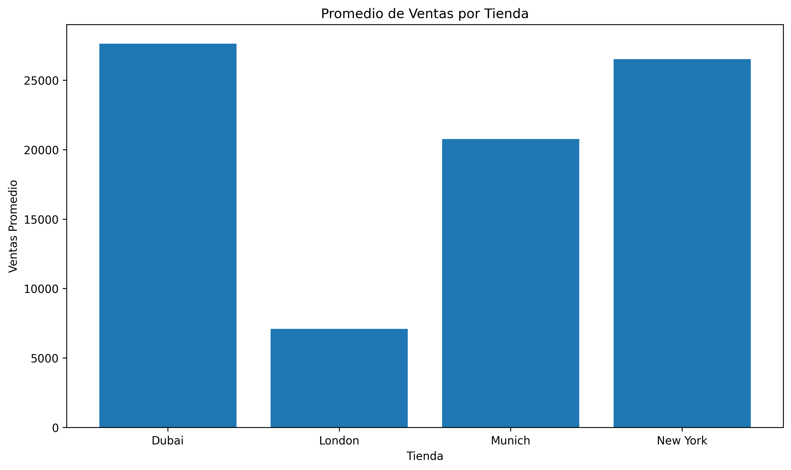
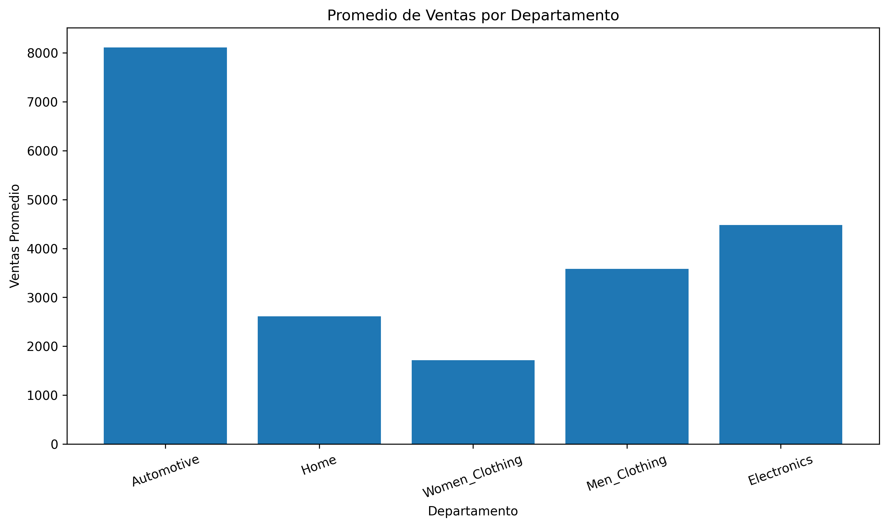
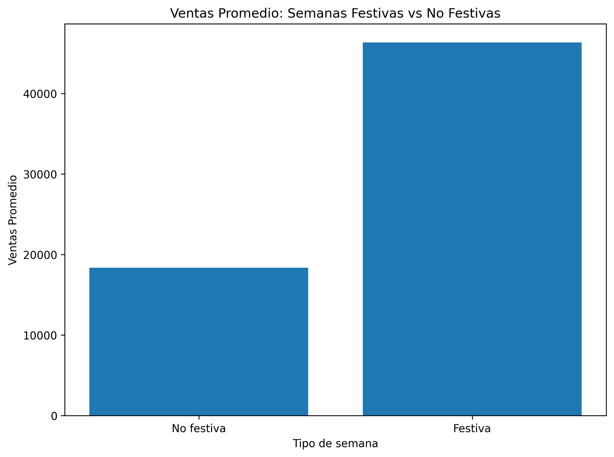

# Análisis de Ventas Retail con Python

Este proyecto analiza datos de ventas en el sector retail para identificar patrones en el desempeño de las tiendas, departamentos y factores externos que pueden influir en las ventas.

El análisis fue realizado utilizando Python y diferentes técnicas estadísticas como estadísticas descriptivas, ANOVA, pruebas t, análisis de correlación y regresión lineal.

## Dataset

El conjunto de datos contiene información de ventas semanales de varias tiendas.

Características principales del dataset:

- 208 observaciones
- 13 variables

Variables principales:

- Store (tienda)
- Week (semana)
- Total_Sales (ventas totales)
- Temperature (temperatura)
- CPI (índice de precios al consumidor)
- Unemployment (desempleo)
- IsHoliday (semana festiva)

También se incluyen variables de ventas por departamento:

- Automotive
- Home
- Women Clothing
- Men Clothing
- Electronics

## Métodos utilizados

Durante el análisis se aplicaron las siguientes técnicas:

- Estadísticas descriptivas
- ANOVA para comparar ventas entre tiendas
- ANOVA para comparar ventas entre departamentos
- Prueba t para comparar semanas festivas vs no festivas
- Análisis de correlación
- Modelo de regresión lineal

## Tecnologías utilizadas

El análisis fue desarrollado en Python utilizando las siguientes librerías:

- pandas
- numpy
- scipy
- statsmodels
- matplotlib
- seaborn

## Visualizaciones

### Promedio de ventas por tienda

### Promedio de ventas por departamento

### Ventas en semanas festivas vs no festivas

## Resultados principales

Algunos de los hallazgos más importantes del análisis son:

- Las semanas festivas generan un incremento significativo en las ventas
- Las tiendas Dubai y New York presentan los mayores promedios de ventas
- El departamento Automotive genera el mayor promedio de ventas
- Los factores externos analizados explican solo una parte limitada del comportamiento de las ventas

